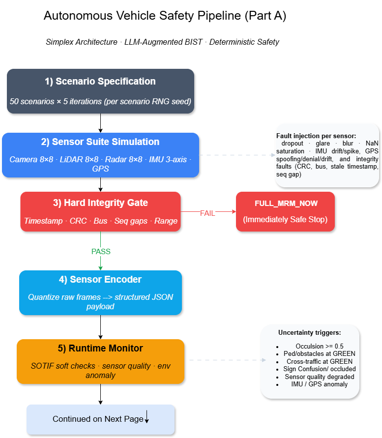
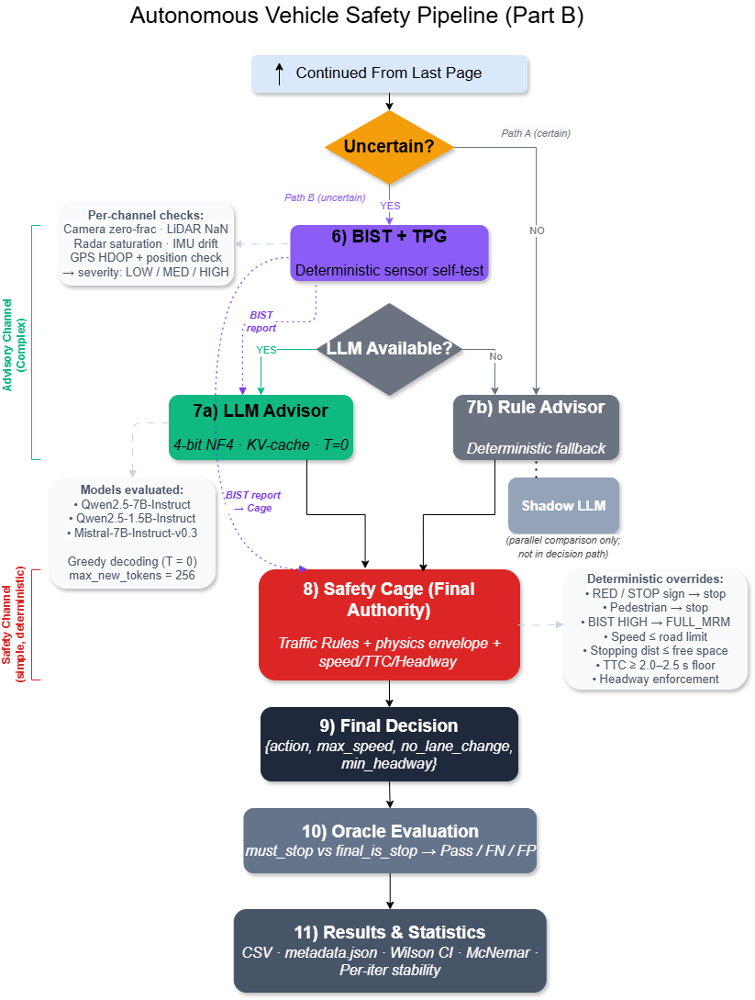
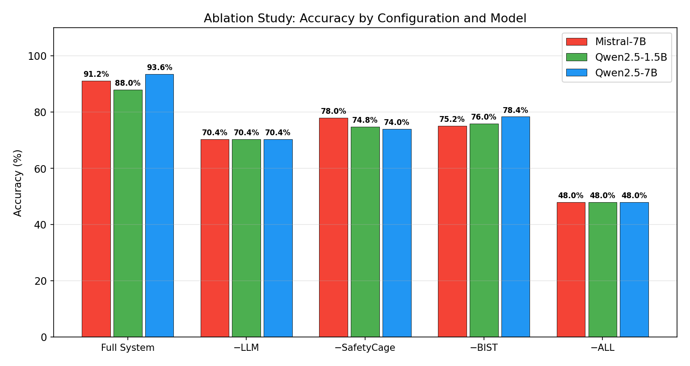
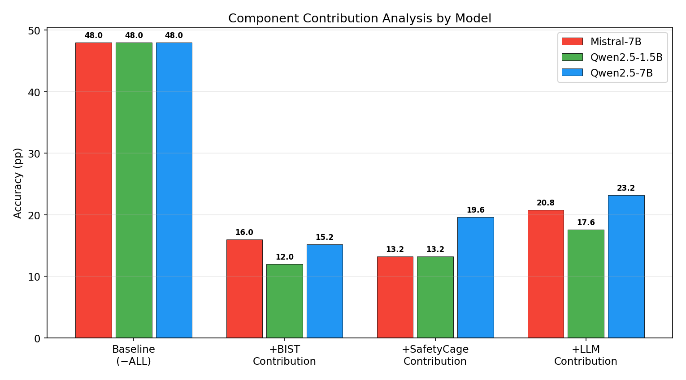
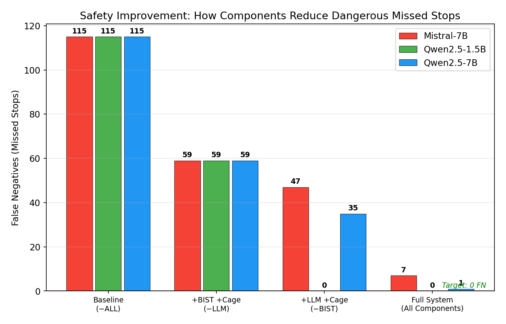
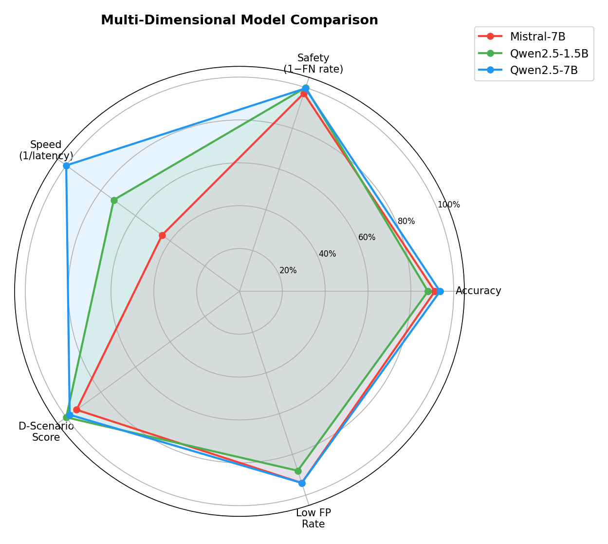
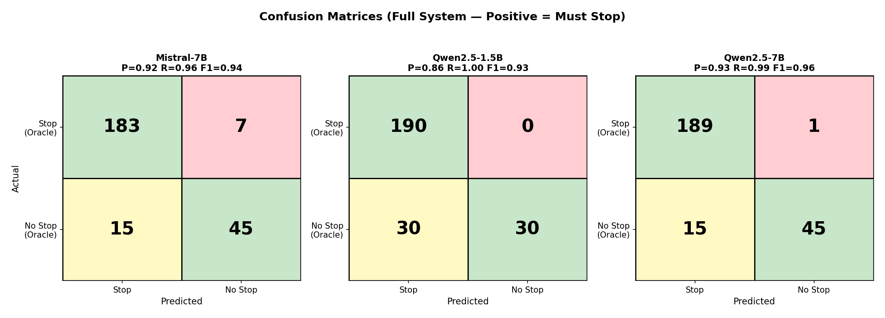
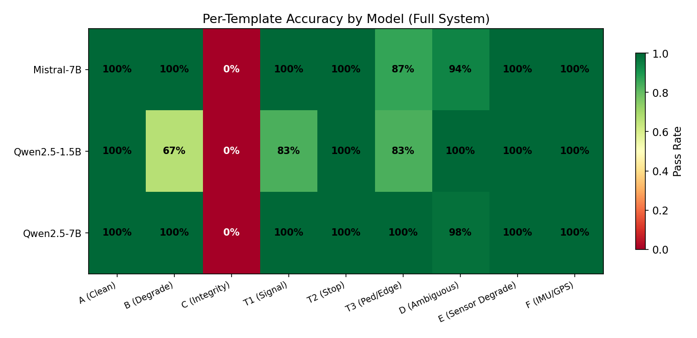
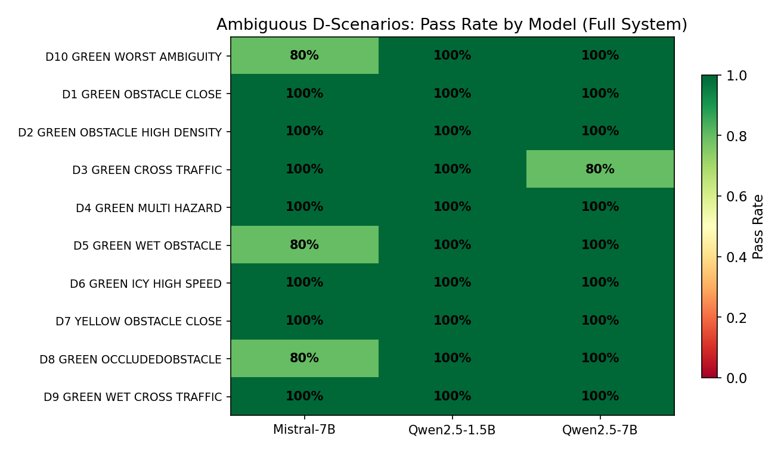
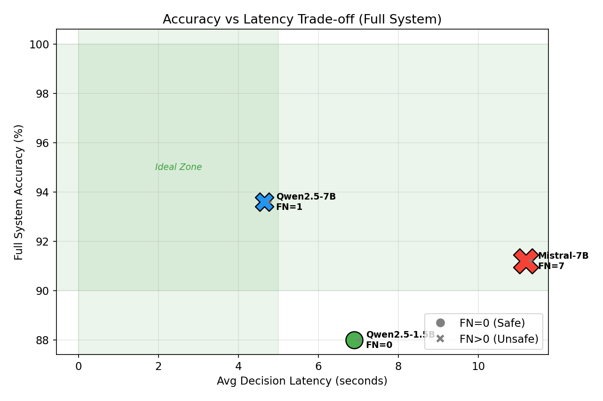

# 🛡️ LLM-Based Safety Architecture for Autonomous Driving

> **Master's Thesis** — Evaluating Large Language Models as Constrained Safety Advisors in a Multi-Layered Autonomous Driving Pipeline

[](https://python.org)
[](https://pytorch.org)
[](https://huggingface.co/docs/transformers)
[](LICENSE)

---

## 📋 Abstract

Rule-based autonomous driving systems fail on **ambiguous, multi-hazard scenarios** — situations where sensor signals conflict (e.g., green light + close obstacle + wet road). Large Language Models can reason about such context, but they **hallucinate** and cannot be trusted with direct vehicle control.

This thesis proposes a **middle ground**: treat the LLM as a *constrained advisor* inside a **six-component safety pipeline**, where a **physics-aware Safety Cage** always has final authority. We evaluate three 4-bit quantized LLMs across 50 scenarios, 5 ablation configurations, and 5 iterations each — producing **3,750 statistically validated decisions**.

---

## 🏆 Key Results

| Model | Accuracy | F1 | Recall | False Negatives | Latency |
|:------|:--------:|:--:|:------:|:---------------:|:-------:|
| **Qwen2.5-7B** | **93.6%** | 0.959 | 0.995 | 1 | 4.6 s |
| Qwen2.5-1.5B | 88.0% | 0.936 | **1.000** | **0** | 6.9 s |
| Mistral-7B | 91.2% | 0.950 | 0.963 | 7 | 11.2 s |
| Baseline (no LLM) | 48.0% | — | — | 115 | — |

> 💡 On ambiguous D-scenarios, accuracy jumps from **2% → 97%** when the LLM is added.  
> 💡 The smaller 1.5B model achieves **zero false negatives** — it never misses a hazard.

---

## 🏗️ System Architecture

The pipeline implements **ISO 26262 defence-in-depth** with six independent safety barriers:

<p align="center">
  
</p>
<p align="center"><em>Part A — Sensor acquisition, integrity gate, encoding, and runtime monitoring</em></p>

<p align="center">
  
</p>
<p align="center"><em>Part B — BIST diagnostics, LLM advisory, Safety Cage override, and oracle evaluation</em></p>

### Pipeline Stages

| Stage | Component | Role |
|:-----:|:----------|:-----|
| 1–2 | **Sensor Suite** | Simulates Camera, LiDAR, Radar, IMU, GPS with realistic fault injection |
| 3 | **HardGate** | Deterministic integrity checks (CRC, timestamps, sequence, range) → emergency stop on failure |
| 4 | **Sensor Encoder** | Transforms raw readings into structured JSON with confidence scores |
| 5 | **Runtime Monitor** | SOTIF-style anomaly detection; routes uncertain scenarios to LLM path |
| 6 | **BIST + TPG** | Built-In Self-Test with Test Pattern Generator; assigns LOW/MEDIUM/HIGH severity |
| 7 | **LLM Advisor** | Contextual reasoning over sensor data + diagnostics; outputs action + rationale |
| 8 | **Safety Cage** | Physics-aware final authority — stopping distance, friction, speed limits, pedestrian override |

---

## 📊 Results

### Ablation Study — Accuracy across configurations

<p align="center">
  
</p>

### Component Contribution (what each layer adds)

<p align="center">
  
</p>

| Component | Accuracy Delta |
|:----------|:--------------:|
| **LLM Advisor** | +17.6 to +23.2 pp |
| **Safety Cage** | +13.2 to +19.6 pp |
| **BIST** | +12.0 to +16.0 pp |

> Components interact **non-additively** — the whole is greater than the sum of its parts.

### False-Negative Elimination & Model Comparison

<p align="center">
  
  
</p>

### More Plots

<p align="center">
  
  
</p>
<p align="center">
  
  
</p>

All 16 plots are available in [`results/plots/`](results/plots/).

---

## 🧪 Experimental Design

| Parameter | Value |
|:----------|:------|
| **Scenarios** | 50 (9 templates: A, B, C, D, E, F, T1, T2, T3) |
| **Models** | Qwen2.5-7B-Instruct, Qwen2.5-1.5B-Instruct, Mistral-7B-Instruct-v0.3 |
| **Quantization** | 4-bit NF4 via bitsandbytes |
| **Configurations** | FULL, −LLM, −SafetyCage, −BIST, −ALL |
| **Iterations** | 5 per scenario (deterministic SHA-256 seeding) |
| **Total Decisions** | 3 models × 5 configs × 50 scenarios × 5 iters = **3,750** |
| **Hardware** | NVIDIA Tesla V100 16 GB, university HPC cluster (SLURM) |
| **Statistical Tests** | Wilson score 95% CI, McNemar's χ² with Yates' correction |

---

## 📁 Repository Structure

```
├── sensor_code_14.py        # Complete codebase (~2,700 lines) — single reproducible script
├── res1.sh                  # SLURM batch script to run the full experiment on HPC
├── requirements.txt         # Python dependencies
├── LICENSE
├── README.md
│
└── results/                 # Experimental outputs (seed=44)
    ├── results.csv          # 3,750 decisions × 27 columns
    ├── pipeline_diagram_partA.drawio.png
    ├── pipeline_diagram_partB.drawio.png
    └── plots/               # 16 publication-ready plots
        ├── ablation_accuracy.png
        ├── ablation_heatmap.png
        ├── accuracy_vs_latency.png
        ├── component_contribution.png
        ├── confusion_matrix.png
        ├── d_scenario_heatmap.png
        ├── fn_elimination_cascade.png
        ├── latency_comparison.png
        ├── latency_distribution.png
        ├── llm_contribution_delta.png
        ├── model_radar_chart.png
        ├── multi_model_summary_table.png
        ├── per_template_accuracy.png
        ├── pipeline_coverage.png
        ├── results_table.png
        └── safety_fp_fn.png
```

---

## 🚀 How to Reproduce

### Prerequisites

- Python ≥ 3.10
- CUDA GPU with ≥ 16 GB VRAM (tested on NVIDIA Tesla V100)

### Setup

```bash
git clone https://github.com/<your-username>/llm-safety-driving.git
cd llm-safety-driving

conda create -n adi python=3.10 -y
conda activate adi
pip install -r requirements.txt
```

### Run Full Experiment (~8 hours on V100)

```bash
# On a SLURM cluster
sbatch res1.sh

# Or locally with GPU
python sensor_code_14.py --model Qwen/Qwen2.5-7B-Instruct --mode final --iters 5 --seed 44
```

### Ablation Experiments

```bash
# Remove LLM → rule-based fallback only
ABLATE_DISABLE_LLM=1 python sensor_code_14.py --model Qwen/Qwen2.5-7B-Instruct --mode ablate --iters 5 --seed 44

# Remove Safety Cage
ABLATE_DISABLE_CAGE=1 python sensor_code_14.py --model Qwen/Qwen2.5-7B-Instruct --mode ablate --iters 5 --seed 44

# Remove BIST diagnostics
ABLATE_DISABLE_BIST=1 python sensor_code_14.py --model Qwen/Qwen2.5-7B-Instruct --mode ablate --iters 5 --seed 44

# Remove ALL (pure baseline)
ABLATE_DISABLE_LLM=1 ABLATE_DISABLE_CAGE=1 ABLATE_DISABLE_BIST=1 \
  python sensor_code_14.py --model Qwen/Qwen2.5-7B-Instruct --mode ablate --iters 5 --seed 44
```

### Regenerate Plots Only

```bash
# Uses existing results.csv to produce all 16 plots + statistical analysis
python sensor_code_14.py --summarize
```

---

## 🔧 Tech Stack

| Component | Technology |
|:----------|:-----------|
| Language | Python 3.10 |
| Deep Learning | PyTorch 2.5.1 (CUDA 12.1) |
| LLM Inference | HuggingFace Transformers 4.57.1 |
| Quantization | bitsandbytes 0.48.2 (4-bit NF4) |
| Statistics | SciPy 1.15.3 (Wilson CI, McNemar's χ²) |
| Visualization | Matplotlib 3.10.8 |
| HPC | SLURM on university GPU cluster |

---

## 🔑 Key Findings

1. **LLM reasoning is essential for ambiguous scenarios** — D-template accuracy: 2% → 97%
2. **4-bit quantization preserves safety reasoning** — <1% loss vs. full precision
3. **Defence-in-depth works** — each component catches errors the others miss
4. **Components interact non-additively** — synergistic improvement exceeds sum of parts
5. **Model size ≠ safety** — the 1.5B model achieves zero false negatives (safest choice)
6. **Over-caging effect** — stacking conservative layers hurts already-conservative models
7. **Latency is the main gap** — 4.6 s best-case vs. 100 ms real-time target → future work

---

## 📜 License

[MIT](LICENSE)

---

<p align="center">
  <strong>⭐ If you find this work useful, please consider giving it a star!</strong>
</p>
